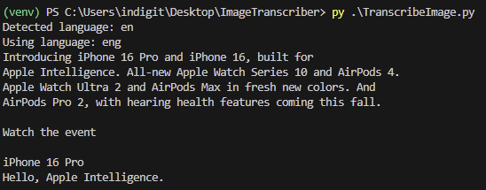

# ImageTranscriber with English OCR and LLAVA Support

## Description
This project uses Optical Character Recognition (OCR) to transcribe text from images with a focus on **English-only OCR**. It leverages the Tesseract OCR engine through the Python library `pytesseract`. Additionally, the project includes support for the **LLAVA** model via the `ollama` command-line tool to describe images and transcribe any visible text.

The script offers two main functionalities:
- **OCR-based Image Transcription**: English-only transcription using Tesseract.
- **LLAVA-based Image Descriptions and Transcriptions**: Uses LLAVA (via `ollama`) to describe and transcribe text in images.

### Demonstration
#### Before:

    
#### After (OCR Output):


#### After (LLAVA Output):


## Prerequisites
Before running the project, ensure the following tools are installed:

- Python 3.x
- `pytesseract`
- `Tesseract-OCR`
- `ollama` for LLAVA model image transcription

### Tesseract-OCR Installation
1. Download and install Tesseract-OCR from the [official Tesseract GitHub repository](https://github.com/tesseract-ocr/tesseract).
2. Ensure that the Tesseract binary is added to your system's PATH. You can do this by adding the following path in your system:
   ```
   $env:PATH += ";C:\Users\indigit\AppData\Local\Programs\Tesseract-OCR\"
   ```

3. You also need to download the trained data file for English (`eng.traineddata`) from the [Tesseract language data repository](https://github.com/tesseract-ocr/tessdata) and place it in the `tessdata` directory of Tesseract.

### Python and Libraries Installation
1. Install Python from [python.org](https://www.python.org/downloads/) if it’s not already installed.
2. Install required Python libraries using `pip`:
   ```bash
   pip install pytesseract Pillow
   ```

### ollama and LLAVA Setup
1. Install `ollama` following the guide on [devturtleblog.com](https://www.devturtleblog.com/ollama-guide/).
2. Set `ollama` to use the LLAVA model:
   ```
   ollama run llava
   ```

## Usage
This project provides two main ways to interact with images:

### 1. **OCR Image Transcription (English only)**
   This option uses Tesseract to extract text in English from an image.
   
### 2. **LLAVA Image Transcription**
   This option uses the `ollama` tool to describe images and transcribe any text present.

### Running the Script
1. Place your images in the appropriate directory.
2. Run the following script for OCR or LLAVA image transcription:

   ```bash
   python Menu.py
   ```

3. Select an option from the menu:
   - **Option 1**: OCR-based transcription (English only)
   - **Option 2**: LLAVA-based image description and transcription
   - **Option 3**: Exit the application

## Example Scripts

### **Menu.py**
This script provides a menu-driven interface to choose between Tesseract OCR and LLAVA image transcription.

```python
import subprocess
import os
from PIL import Image
import pytesseract

# Ensure environment paths are set
os.environ["PATH"] += ";C:\Users\indigit\AppData\Local\Programs\Tesseract-OCR\"
os.environ["PATH"] += ";C:\Users\indigit\AppData\Local\Programs\Ollama\"

# Define image paths
image_paths = [
    "/Users/indigit/Desktop/ImageTranscriber/test.png",
]

# Display menu options
def display_menu():
    print("WELCOME TO THE IMAGE TRANSCRIBING TOOL")
======================================
Select an option:")
    print("1. OCR Image Transcription (English only)")
    print("2. LLAVA Image Transcription")
    print("3. Exit")

# OCR Transcription (Tesseract)
def ocr_transcription():
    def image_to_text(image_path, lang='eng'):
        try:
            with Image.open(image_path) as img:
                text_data = pytesseract.image_to_string(img, config=f'--oem 1 --psm 1', lang=lang)
            return text_data
        except Exception as e:
            return f"Error processing {image_path}: {str(e)}"

    print("OCR Image Transcription (English only)")
    for path in image_paths:
        print(f"Processing {path}:")
        final_extracted_text = image_to_text(path)
        print(f"{final_extracted_text}")

# LLAVA Transcription
def llava_transcription():
    print("LLAVA Image Transcription")
    for image in image_paths:
        print(f"Processing: {image}")
        command = [
            "ollama", 
            "run", 
            "llava", 
            f"Describe what you see in this picture and transcribe any text you see {image}"
        ]
        subprocess.run(command)

# Main function
def main():
    while True:
        display_menu()
        choice = input("Enter your choice: ").strip()

        if choice == '1':
            ocr_transcription()
        elif choice == '2':
            llava_transcription()
        elif choice == '3':
            print("Exiting...")
            break
        else:
            print("Invalid choice, please try again.")

if __name__ == "__main__":
    main()
```

## Troubleshooting
- Ensure that the Tesseract binary is correctly added to your PATH, or set the path in the script:
  ```python pytesseract.pytesseract.tesseract_cmd = r'C:\Program Files\Tesseract-OCR\tesseract.exe'
  ```

For more assistance with `ollama` or LLAVA, refer to the relevant [guides](https://www.devturtleblog.com/ollama-guide/).

## License
This project is licensed under the MIT License - see the LICENSE file for details.
