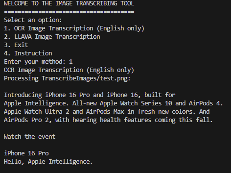

# ImageTranscriber with English OCR and LLAVA Support

## Contributors
- **Khang Hoang**

## Description
ImageTranscriber is a Python-based tool for transcribing text from images using **English OCR** and **LLAVA-based descriptions and transcription**. It provides two main functionalities:

- **OCR-based Image Transcription**: Uses Tesseract to transcribe English text from images.
- **LLAVA-based Image Descriptions and Transcriptions**: Uses LLAVA (via `ollama`) to describe images and extract any visible text.

### Demonstration
#### Before:

    
#### After (OCR Output):


## Prerequisites
Before running the project, ensure you have the following tools installed:

- Python 3.x
- `pytesseract`
- `Tesseract-OCR`
- `ollama` for LLAVA model image transcription

### Installation and Setup

#### 1. Tesseract-OCR Installation
1. Download and install Tesseract-OCR from the [official Tesseract GitHub repository](https://github.com/tesseract-ocr/tesseract).
2. Add the Tesseract binary to your system's PATH. For Windows, this can be done as follows:
   ```powershell
   $env:PATH += ";C:\Users\indigit\AppData\Local\Programs\Tesseract-OCR\"
   ```
3. Download the English language file (`eng.traineddata`) from the [Tesseract language data repository](https://github.com/tesseract-ocr/tessdata) and place it in the `tessdata` directory.

#### 2. Python Libraries Installation
1. Install Python from [python.org](https://www.python.org/downloads/) if it’s not already installed.
2. Install required Python libraries using `pip`:
   ```bash
   pip install pytesseract Pillow
   ```

#### 3. ollama and LLAVA Setup
1. Install `ollama` following the guide on [devturtleblog.com](https://www.devturtleblog.com/ollama-guide/).
2. Configure `ollama` to use the LLAVA model:
   ```bash
   ollama run llava
   ```

## Usage
This project provides two main ways to interact with images:

1. **OCR Image Transcription (English only)**: Extracts English text from images using Tesseract.
2. **LLAVA Image Transcription**: Uses the `ollama` tool with LLAVA to describe images and transcribe visible text.

### Running the Application
1. Place your images in the `TranscribeImages` directory or any subdirectories within it. The tool will recursively search through this folder.
2. Run the application by executing the following command:
   ```bash
   python Menu.py
   ```
3. Select an option from the menu:
   - **Option 1**: OCR-based transcription (English only)
   - **Option 2**: LLAVA-based image description and transcription
   - **Option 3**: Exit the application

### Example File Descriptions

#### `Menu.py`
This script displays a menu and allows users to select either the OCR or LLAVA transcription option.

#### `OCR.py`
This module handles all OCR-based transcription. It searches recursively in the `TranscribeImages` directory for images and uses Tesseract to extract text. If no text is detected, it informs the user that OCR may not be supported for the image.

#### `llavaRunner.py`
This module handles LLAVA-based image transcription. Like `OCR.py`, it searches recursively through `TranscribeImages` for images. Using the `ollama` tool, it provides descriptions and text transcriptions for each image.

## Troubleshooting
- Ensure that the Tesseract binary is correctly added to your PATH. If necessary, specify the Tesseract path in `OCR.py` directly:
  ```python
  pytesseract.pytesseract.tesseract_cmd = r'C:\Program Files\Tesseract-OCR\tesseract.exe'
  ```
- For GPU support with LLAVA, refer to the relevant [ollama guide](https://www.devturtleblog.com/ollama-guide/) or the backend configuration to confirm if GPU options are available.

## License
This project is licensed under the MIT License - see the LICENSE file for details.


